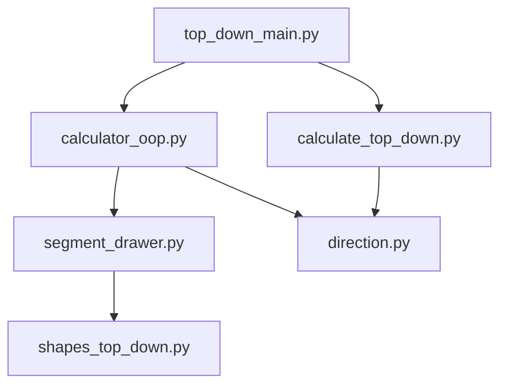

# DrawScaffold - Kod Yapısı ve Değişiklik Dokümantasyonu

**Son Güncelleme:** 28 Ocak 2026

---

## 📁 Proje Yapısı

```
drawscaffold/
├── top_down_main.py           # Ana CLI giriş noktası
├── generate_random_scaffold.py # Rastgele scaffold üretici
│
├── drawscaffold/
│   ├── model/                  # 🆕 YENİ OOP Modülleri
│   │   ├── direction.py        # Yön abstraction'ı
│   │   ├── material_calculator.py  # Malzeme hesaplama
│   │   ├── facade_drawer.py    # Cephe çizimi
│   │   ├── calculator_oop.py   # Segment hesaplayıcı
│   │   ├── segment_drawer.py   # Segment çizici
│   │   └── facade_model.py     # Veri modelleri
│   │
│   ├── calculate_top_down.py   # ✅ Sadeleştirildi (955→260 satır)
│   ├── drawer_top_down.py      # ✅ Sadeleştirildi (910→250 satır)
│   │
│   ├── calculator/             # Hesaplayıcılar
│   ├── const/                  # Sabitler
│   ├── diagonal/               # Diyagonal hesaplamaları
│   ├── shapes/                 # Şekil çizimleri
│   └── utils/                  # Yardımcı araçlar
│
├── docs/                       # Dokümantasyon
└── manual_output/              # Çıktı klasörü
```

---

## 🔄 Yapılan Değişiklikler

### 1. Direction Abstraction (`model/direction.py`)

**Amaç:** 4 yön için tekrarlanan kodu tek bir sınıfa indirgeme

```python
@dataclass
class Direction:
    key: str      # F, R, B, L
    dx: int       # X yönü (-1, 0, 1)
    dy: int       # Y yönü (-1, 0, 1)
    gap_offset: Tuple[int, int]
    scaffold_side: ScaffoldSide
    is_horizontal: bool

DIRECTIONS = {
    'F': Direction(key='F', dx=1, dy=0, ...),
    'R': Direction(key='R', dx=0, dy=1, ...),
    'B': Direction(key='B', dx=-1, dy=0, ...),
    'L': Direction(key='L', dx=0, dy=-1, ...),
}
```

**Yardımcı fonksiyonlar:**
- `calculate_modules(length)` - Modül listesi hesaplama
- `parse_facade_command(item)` - Komut ayrıştırma

---

### 2. Legacy Kod Sadeleştirmesi

#### calculate_top_down.py
| Önce | Sonra | Değişiklik |
|------|-------|------------|
| 955 satır | ~260 satır | **-73%** |
| 660 satırlık `count_facades` | Kaldırıldı | Direction abstraction kullanılıyor |

**Korunan fonksiyonlar:**
- `MaterialCounterTopDown` - Malzeme sayacı sınıfı
- `frontal_calculator2D()` - 2D profil hesaplama
- `top_down_calc()` - Ana giriş noktası

#### drawer_top_down.py
| Önce | Sonra | Değişiklik |
|------|-------|------------|
| 910 satır | ~250 satır | **-73%** |
| 795 satırlık `draw_facades` | Modüler fonksiyonlara bölündü | |

**Yeni yapı:**
- `top_down_drawer()` - Ana giriş noktası
- `_draw_all_facades()` - Tüm cepheleri çiz
- `_draw_segment()` - Tek segment çiz
- `_save_outputs()` - Çıktıları kaydet

---

### 3. Yeni OOP Modülleri

#### material_calculator.py
```python
class MaterialCounter:
    """Malzeme sayacı"""
    
class FloorCalculator:
    """Kat bazlı malzeme hesaplama"""
    
class SegmentMaterialCalculator:
    """Segment malzeme hesaplama"""
    
class FacadeMaterialCalculator:
    """Tüm cepheler için ana hesaplayıcı"""
```

#### facade_drawer.py
```python
class FacadeSegmentDrawer:
    """Tek segment çizimi"""
    
class FacadeDrawer:
    """Tüm cephelerin çizimi ve çıktı üretimi"""
```

---

## 🖥️ CLI Kullanımı

### Yeni Format (Önerilen)
```bash
poetry run python top_down_main.py \
  --wall F:2000 --wall R:1500 --wall B:2000 --wall L:1500 \
  --feature F:inset,500,300 \
  --height-in-cm 1500 \
  --image \
  --project-name my_scaffold
```

### Argümanlar
| Argüman | Açıklama | Örnek |
|---------|----------|-------|
| `--wall` | Duvar tanımı | `F:2000` (Ön cephe, 2000cm) |
| `--feature` | Özellik (inset/outset) | `F:inset,500,300` |
| `--adjust-corners` | Köşe ayarlaması | |
| `--no-150` | 150cm modül kullanma | |
| `--height-in-cm` | Yükseklik | `1500` |
| `--surface-slope` | Eğim açısı | `15` |
| `--image` | PNG çıktısı | |

### Legacy Format
```bash
poetry run python top_down_main.py \
  --facade "inset,300,2000,250,F" \
  --facade "outset,700,1500,250,R" \
  --height-in-cm 1500 \
  --image
```

---

## 📊 Çıktılar

Çıktılar `manual_output/YYYY_MM_DD_HH_MM_SS/` altına kaydedilir:

| Dosya | Açıklama |
|-------|----------|
| `*.png` | Görüntü çıktısı |
| `*.svg` | Vektör çıktısı |
| `*.dxf` | CAD çıktısı |
| `materials.json` | Malzeme listesi |

---

## 🔧 Modül Bağımlılıkları



---

## 📝 Notlar

1. **Geriye Uyumluluk:** Eski API'ler (`top_down_calc`, `top_down_drawer`) çalışmaya devam ediyor
2. **Yeni Geliştirmeler:** OOP modülleri kullanılmalı (`FacadeMaterialCalculator`, `FacadeDrawer`)
3. **Test:** Her değişiklikten sonra `poetry run python top_down_main.py` ile test edilmeli
